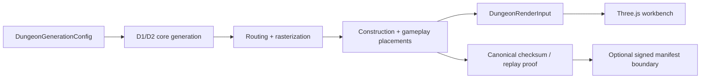

# sturdy-sniffle

  

A Generator WorkShop containing the deterministic Catacombs dungeon-generator prototype for the Web Companion App.

## 🏛️ Catacombs dungeon generator

| Topic | Current state |
| --- | --- |
| Implemented environment | **Catacombs** only. |
| Planned environments | Garden Maze, Dark Tower, Hell’s Canyon. |
| Product boundary | Web Companion App generator and diagnostic workbench; it does **not** directly generate Godot/MMORPG client maps. |
| Authority boundary | Server-side generation and signed online manifests are authoritative; local workbench generation is prototype/diagnostic only. |
| Client boundary | Browser clients consume validated `DungeonRenderInput` for rendering; diagnostics and `ResolvedDungeon` are not production network payloads. |
| Seed model | Canonical T1 seed inputs are unsigned 32-bit numeric seeds; `seed-*` aliases are rejected by T1 replay/property tooling. |
| Current status | D1, D2, D3, T1A, T1B, and T1C are complete under Node.js 24.18.0. |



The production pipeline normalizes configuration, composes physical room candidates, packs shape-aware rooms, builds a real Delaunay candidate graph with bounded fallback recovery, derives a deterministic constrained MST, refines topology, assigns semantic Catacombs rooms, selects doorways, routes corridors, reserves occupancy, rasterizes tiles, validates navigation, emits construction records, places gameplay presentation records, applies game-type/difficulty/player-count transformations, creates render input, and supports canonical checksum/replay verification.

## Runtime prerequisites

- Node.js **24.18.0**.
- npm **11.16.0**, the npm bundled with Node.js 24.18.0.
- `package.json` requires `node >=24.18.0 <25`.
- `.nvmrc` pins `24.18.0` for nvm users.
- Validate with `npm run check:runtime`.

No Dockerfile, Docker Compose file, or dev-container definition is present in this repository, so container runtime support is not claimed.

## Setup and main commands

```sh
nvm install && nvm use
node --version
npm --version
npm ci
npm run check:runtime
npm run build
npm run build:workbench
npm run check:workbench
```

The generated single-file browser workbench is written to `dungeon-generator-workbench.html`. T1 artifacts are written under `artifacts/t1/`; coverage is written under `coverage/`; Playwright outputs use `playwright-report/` and `test-results/` when produced.

### Qualification commands

| Command | Purpose |
| --- | --- |
| `npm run typecheck` | TypeScript compile check without emit. |
| `npm run build` | Repository TypeScript build. |
| `npm run build:workbench` | Bundle the single-file workbench. |
| `npm run check:workbench` | Verify generated workbench fingerprint/currentness. |
| `npm run test:unit` | Unit coverage for generation, contracts, workbench helpers, replay/reconcile helpers. |
| `npm run test:integration` | Complete generation/routing/workbench integration checks. |
| `npm run test:security` | Import, manifest, authorization, and security-boundary checks. |
| `npm run test:property:pr` | PR property shard: 6 deterministic cases, 1 shard. |
| `npm run test:regression` | Replay corpus/regression checks (`t1c-corpus-v1`, 11 cases). |
| `npm run test:performance` | Deterministic Node performance qualification and `artifacts/t1/performance-summary.json`. |
| `npm run test:coverage -- --coverageReporters=text-summary` | Coverage gate and summary. |
| `npm run test:browser` | Playwright browser behavior checks. |
| `npm run test:visual` | Playwright visual regression. |
| `npm run test:accessibility` | Playwright/axe accessibility check. |
| `npm run test:t1` | Complete T1 qualification orchestrator. |
| `npm run check:docs` | Markdown link/path/script/runtime reference validation. |
| `npm audit --audit-level=high` | High-severity dependency audit. |

Install Playwright Chromium with the repository-supported command when needed:

```sh
npx playwright install --with-deps chromium
```

## Replay and performance examples

```sh
npm run test:replay -- --seed 2882400001 --config eyJyb290U2VlZCI6IjI4ODI0MDAwMDEiLCJnZW5lcmF0b3JWZXJzaW9uIjoidDEtdGVzdCIsImVudmlyb25tZW50SWQiOiJjYXRhY29tYnMiLCJnYW1lVHlwZSI6Imh1bnQiLCJkaWZmaWN1bHR5Ijoibm9ybWFsIiwiYXV0aG9yaXplZFBsYXllckNvdW50IjoxLCJzdHJ1Y3R1cmFsTW9kaWZpZXJzIjpbXX0
npm run test:replay -- --record test/dungeon/regression/t1.seed-corpus.json
npm run test:property:nightly -- --runInBand
npm run test:property:reconcile -- --level nightly --shards 4 --dir artifacts/t1/property
npm run test:performance
```

For POSIX shard overrides use `T1_PROPERTY_SHARD=2 T1_PROPERTY_SHARDS=4 npm run test:property:nightly`. For PowerShell use `$env:T1_PROPERTY_SHARD=2; $env:T1_PROPERTY_SHARDS=4; npm run test:property:nightly`.

## Documentation index

- **Normative architecture and contracts:** [Catacombs blueprint package](docs/blueprints/catacombs-reference-generator/README.md) and [main blueprint](docs/blueprints/catacombs-reference-generator/main_blueprint.md).
- **Operational guide:** [DOC1 operations guide](docs/blueprints/catacombs-reference-generator/doc1_operations.md).
- **Historical analysis:** [Catacombs workbench gap analysis](docs/analysis/catacombs-workbench-gap-analysis.md) is historical and pre-T1; use it only for context.

## Development status and next pointer

DOC1 documents the completed deterministic foundation and T1 qualification. Do not begin another foundation rewrite. The next prototype milestone should be a bounded user-visible capability; see the [prototype-resumption handoff](docs/blueprints/catacombs-reference-generator/doc1_operations.md#prototype-resumption-handoff).
