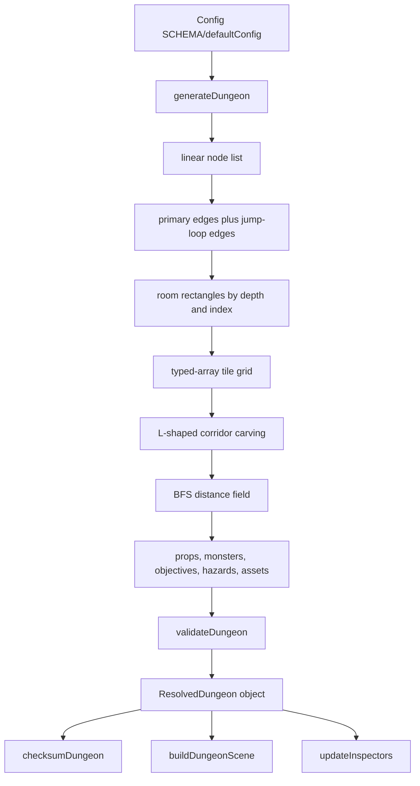
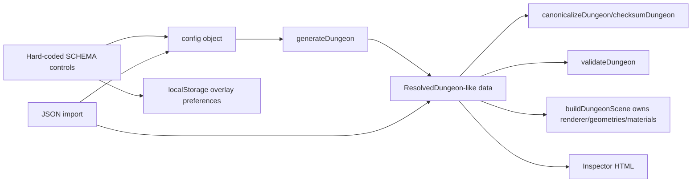

**DOC1 status:** Historical pre-T1 analysis. For current implemented authority, lifecycle, runtime, and commands, defer to [../blueprints/catacombs-reference-generator/README.md](../blueprints/catacombs-reference-generator/README.md), [../blueprints/catacombs-reference-generator/main_blueprint.md](../blueprints/catacombs-reference-generator/main_blueprint.md), and [../blueprints/catacombs-reference-generator/doc1_operations.md](../blueprints/catacombs-reference-generator/doc1_operations.md).

# Catacombs Workbench Gap Analysis

## 1. Executive summary

**Readiness verdict: READY WITH BLOCKERS RECORDED.** The repository is small and consists of a legacy `index.html`, a completed single-file `dungeon-generator-workbench.html`, `README.md`, and a large `blueprint.md` reference prompt. No `AGENTS.md` files were present under the repository parent during inspection. The workbench is inspectable and broad enough to support a Catacombs Reference Generator Blueprint, but the final Blueprint must treat many displayed features as diagnostic scaffolding rather than production implementation.

Most important observed facts:

- The completed workbench is a single HTML file with inline CSS and inline JavaScript, and it imports pinned Three.js ESM from jsDelivr at `three@0.160.0` (`dungeon-generator-workbench.html` — `THREE_ESM_URL`, line 20).
- The active generator is `generateDungeon(cfg)` in the workbench, not a separated source module (`dungeon-generator-workbench.html` — `generateDungeon`, line 46).
- Generation returns a broad `ResolvedDungeon`-like object with typed-array grid fields, diagnostics, validation, assets, and checksum placeholder (`dungeon-generator-workbench.html` — object `d`, line 46).
- The workbench currently cannot be considered a production Catacombs generator: graph grammar, spatial settlement, gameplay, assets, authority, tests, and diagnostics contain hard-coded, estimated, or simulated data (`dungeon-generator-workbench.html` — diagnostics and inspector status text, line 60).
- The historical `index.html` references missing `src/ui/styles.css` and `src/main.js`, and retains prototype theme chips `ancient`, `molten`, `frost`, `grim`, and `verdant` (`index.html` — stylesheet/script references and theme controls, lines 30, 62-66, 121).

## 2. Repository scope and inspected files

No applicable `AGENTS.md` files were found by `find .. -name AGENTS.md -print`.

| Path | Lines | Purpose | Status | Evidence |
|---|---:|---|---|---|
| `dungeon-generator-workbench.html` | 69 | Completed Catacombs diagnostic workbench; contains HTML, CSS, config schema, generator, validation, Three.js scene builder, inspectors, import/export, and in-page tests. | Active workbench | Title and module entry (`title`, `<script type="module">`) at lines 7 and 18. |
| `index.html` | 123 | Older prototype shell for animated dungeon generator. It expects files not present in this repo. | Historical/broken reference | Missing `./src/ui/styles.css` and `./src/main.js` references at lines 30 and 121. |
| `blueprint.md` | 10,753 | Requirements/reference prompt; contains repeated workbench requirements and old-theme deprecation guidance. | Reference-only | Workbench requirement text around lines 2693-2875 and contract around lines 3673-3803. |
| `README.md` | 2 | Minimal repository description. | Documentation stub | Two-line file by `wc -l`. |
| `docs/analysis/catacombs-workbench-gap-analysis.md` | new | This analysis report. | New report | Created by this task. |

Entry points: `dungeon-generator-workbench.html` is the useful browser entry point. `index.html` is not runnable from the present repository because referenced `src` files are absent.

There are no package manifests, lockfiles, source directories, asset directories, authored models, or standalone test files found by `rg --files`.

## 3. Runtime and dependency map

| Area | Observation | Status | Evidence | Blueprint action |
|---|---|---|---|---|
| Single-file workbench | HTML, CSS, and JS are all inline. | IMPLEMENTED | `<style>` at line 8; `<script type="module">` at line 18. | Preserve as diagnostic packaging or extract later under explicit module plan. |
| Three.js loading | Pinned CDN ESM import from jsDelivr. | IMPLEMENTED | `THREE_ESM_URL='https://cdn.jsdelivr.net/npm/three@0.160.0/build/three.module.js'` at line 20; dynamic `await import` at line 21. | Keep version pin; decide whether production uses local vendored/bundled Three.js. |
| Static server | The page warns that `file://` cannot load the module. | IMPLEMENTED | `fileWarn` content at line 15; `location.protocol==='file:'` handler at line 23. | Document `python3 -m http.server` for workbench usage. |
| Build step | None found. | MISSING | No `package.json`; only four files before report. | Blueprint must define build/test packaging separately if needed. |
| Startup verification | JavaScript syntax checks under Node after extracting the module. | NOT VERIFIED in browser | `node --check /tmp/workbench.js` passed; no browser server was started. | Add browser smoke test later. |
| Browser/WebGL | Requires browser modules, Web Crypto, WebGL, WebGL instancing via Three.js. | PARTIAL | `crypto.subtle.digest` at line 28; `THREE.WebGLRenderer` at line 48. | Define minimum browser/WebGL baseline. |

## 4. Current generation pipeline

Observed pipeline in `generateDungeon(cfg)` (`dungeon-generator-workbench.html`, line 46):

Pipeline status: **PARTIAL**. It is deterministic diagnostic generation after a root seed is chosen, but graph, spatial, assets, gameplay, metrics, and tests are not production-complete.

## 5. Current data-flow diagram

## 6. Generator/presentation boundary assessment

- **Generator/Three separation: PARTIAL.** `generateDungeon()` does not create Three.js objects and produces plain objects plus typed arrays, while `buildDungeonScene()` owns `THREE.WebGLRenderer`, `THREE.Scene`, geometries, materials, meshes, and RAF loop (`dungeon-generator-workbench.html` — lines 46 and 48).
- **Resource lifecycle: PARTIAL.** Regeneration calls `disposeDungeonScene(sceneHandle)` before building the next scene, and scene traversal disposes geometries/materials plus renderer and canvas (`dungeon-generator-workbench.html` — lines 50 and 62). However, global window event listeners are attached by every scene and only removed for pointer move/up; wheel/pointerdown are on the canvas and removed, but no shared asset-cache policy exists.
- **Gameplay/rendering separation: PARTIAL.** Gameplay arrays exist, but scene builder renders monsters, hazards, objectives, and bosses as debug spheres (`dungeon-generator-workbench.html` — lines 46 and 48). These are markers, not authoritative gameplay.
- **Debug overlay separation: PLACEHOLDER.** Overlay checkboxes are generated from names, but overlays are not wired to actual scene layers (`dungeon-generator-workbench.html` — `OVERLAYS`, line 52; `updateInspectors`, line 60).

## 7. Determinism assessment

| Requirement | Status | Evidence | Gap | Blueprint action |
|---|---|---|---|---|
| Root seed | IMPLEMENTED | `session.seed` in schema at line 35; `streams(+cfg.session.seed)` at line 46. | None for root seed storage. | Preserve field and define server/source semantics. |
| Random seed selection | IMPLEMENTED | Dice uses `crypto.getRandomValues` then regenerates at line 65. | Good for root selection only. | Keep browser crypto only for new root seed selection. |
| Seeded RNG | IMPLEMENTED | `hashStr`, `mulberry32`, and named `streams()` at line 31. | Algorithm/version not separately declared. | Preserve or replace with specified, versioned RNG. |
| Named streams | PARTIAL | Streams include graph, roomAssignment, spatialEmbedding, corridorRouting, construction, encounters, hazards, objectives, bosses, props, naming at line 31. | Not all streams are used consistently; room assignment uses index patterns. | Define stream ownership per stage. |
| Canonical serialization | PARTIAL | `stable()` sorts object keys and summarizes typed arrays; `canonicalizeDungeon()` deletes only `diagnostics.performanceMetrics.fps` at lines 27-28. | Includes timing fields and config/UI fields; typed arrays are summarized rather than serialized losslessly. | Define canonical payload and excluded non-authoritative fields. |
| Checksum | PARTIAL | SHA-256 digest via Web Crypto at line 28. | No server comparison or signature; checksum includes volatile `totalGenerationMs`. | Separate canonical checksum from diagnostics/performance. |
| Time dependencies | HIGH risk | `performance.now()` populates `totalGenerationMs` at lines 46 and diagnostics performance at line 46. | Same seed checksum can vary because timing remains in canonical data. | Exclude all timing/performance from canonical checksum. |
| `Math.random`/`Date.now` | IMPLEMENTED absent | `rg` found no `Math.random` or `Date.now` in workbench. | Not browser-executed. | Add static determinism test. |
| Repeated-seed tests | PARTIAL | In-page `runTests()` compares three checksums at line 63. | Many asserts are constant `true`; no CI harness. | Extract deterministic tests. |

## 8. Shared graph grammar assessment

The current model has `worldGraph`, `areaGraphs`, and `roomGraph`, but they are all projections of the same room node list (`dungeon-generator-workbench.html` — object `d`, line 46). Grid tiles are separate typed arrays, so room nodes are not literally grid cells; however, the world/area/room hierarchy is not semantically distinct.

| Requirement | Status | Evidence | Gap | Blueprint action |
|---|---|---|---|---|
| World/area graph | PLACEHOLDER | `worldGraph:{id:'world.catacombs',nodes:nodes.map...}` and one `areaGraphs` entry at line 46. | Same node IDs as room graph. | Define true hierarchy. |
| Room and passage graph | PARTIAL | `roomGraph:{nodes,edges}`, `rooms`, `edges` at line 46. | Linear trunk plus shortcuts; no grammar validator. | Keep shape, replace algorithm. |
| Tile-navigation graph | PARTIAL | `navigationMask`, `distanceField`, `clearanceField` at line 46. | No explicit nav graph nodes/edges. | Add nav regions/portals. |
| Rendered scene | IMPLEMENTED diagnostic | `buildDungeonScene()` consumes grid and marker arrays at line 48. | Diagnostic primitives only. | Preserve as fallback visualization. |
| Primary trunk | PARTIAL | All adjacent edges are `role:'primary'` at line 46. | Makes every room a primary chain, not one trunk plus branches. | Replace with grammar-produced trunk. |
| Secondary trunks | SIMULATED | Config has `secondaryTrunks`; metrics report it, but branch creation ignores it except labels/metrics at line 46. | No true secondary trunk nodes. | Implement secondary trunk grammar. |
| Divergences/reconvergences | SIMULATED | Metrics echo config counts at line 46. | Edges jump forward but no explicit divergence/reconvergence metadata. | Add branch events and validation. |
| Immediate/conditional/secret loops | PARTIAL | Edges are added with roles/states/secret flags at line 46. | They are arbitrary forward jumps, not route reconvergence products. | Constrain by layered grammar. |
| Dead ends | SIMULATED | `deadEnds` metric echoes config; branch edges may role `dead-end` but reconverge at `start+len` at line 46. | Not actual terminal branch with purpose. | Implement terminal branch purpose rules. |
| Critical path | PARTIAL | `critical:i<cfg.graph.primaryLength` on nodes and `critical:role==='primary'` on edges at line 46. | Critical nodes may not align with full primary finish. | Define initial/final critical paths. |
| Articulation points | PLACEHOLDER | Metric hard-coded `articulationPoints:0` at line 46. | No analysis. | Add Tarjan/articulation diagnostics. |

## 9. Catacombs Graph Layout assessment

| Requirement | Status | Evidence | Gap | Blueprint action |
|---|---|---|---|---|
| One primary trunk | PARTIAL | Adjacent `n(i)->n(i+1)` edges all primary at line 46. | Primary chain spans all rooms, leaving no true side rooms. | Generate a main trunk and attach branches. |
| Zero+ secondary trunks | SIMULATED | `graph.secondaryTrunks` in schema/metrics at lines 36 and 46. | Not used to construct trunk structures. | Implement. |
| Forward depth | PARTIAL | Node `depth` from index/depthLayers at line 46. | Not validated against edge direction/deeper reconvergence. | Add depth constraints. |
| Diverge/reconverge deeper | PARTIAL | Branch edges connect `start` to `start+len`; loops connect `a` to deeper `a+2/a+3` at line 46. | No route nodes between divergence and reconvergence; lateral constraints absent. | Model branch subpaths. |
| Bidirectional traversal | IMPLEMENTED | Edges have `directed:false` at line 46. | No traversal-state model. | Preserve ordinary bidirectionality. |
| No arbitrary lateral cross-links | PARTIAL | Current links only go forward by index. | Spatial corridors can cross and graph ignores lanes. | Validate no lateral/depth-equal links. |
| Conditional loops locked/disabled | PARTIAL | Conditional loop edges use `state:'closed'` at line 46. | No unlock objective/session authority. | Add immutable + mutable state split. |
| Secrets optional | PARTIAL | Secret edges have `secret:true` and `state:'secret'` at line 46. | No optionality validation/reward separation. | Add secret branch model. |
| Declared dead-end purposes | PARTIAL | Branches get `purpose:'optional-combat'` or `reward` at line 46. | Dead-end edges are not represented as terminal branch node sequences. | Add dead-end terminal nodes and purpose enum. |
| Boss Antechamber then Boss Sepulcher | MISSING | Only final room function is `boss` at line 46. | No archetype sequence. | Implement mandatory terminal archetypes. |
| Boss near max depth | PARTIAL | Final node `N-1` is finish/boss and has deepest index at line 46. | Boss room is generic `boss`, not Sepulcher with clearance contract. | Formalize boss placement. |

## 10. Room-system assessment

Observed room fields: `id`, `name`, `graphNodeId`, `function`, `category`, `scale`, `x`, `y`, `w`, `h`, `depth`, `simulated` (`dungeon-generator-workbench.html`, line 46). Rooms are simple rectangles. There is no real archetype library, shape implementation, adjacency matrix, degree constraint enforcement, door capacity model, content slots, or multiplayer footprint validation.

Catacombs archetype status:

| Archetype | Status | Evidence | Required action |
|---|---|---|---|
| Mausoleum Entrance | PARTIAL | First node function `entrance`; no archetype name at line 46. | Add archetype. |
| Entry Crypt | MISSING | No string found in active workbench. | Add. |
| Burial Passage | MISSING | No string found. | Add. |
| Ossuary Gallery | MISSING | No string found. | Add. |
| Crypt Junction | MISSING | No string found. | Add. |
| Gate Chamber | MISSING | No string found. | Add. |
| Family Crypt | MISSING | No string found. | Add. |
| Burial Cell | MISSING | No string found. | Add. |
| Embalming Chamber | MISSING | No string found. | Add. |
| Bone Repository | MISSING | No string found. | Add. |
| Reliquary | MISSING | No string found. | Add. |
| Memorial Chapel | PARTIAL | `shrine` and schema `chapel` weight exist at lines 37 and 46, but no named archetype. | Add. |
| Royal Cubiculum | MISSING | No string found. | Add. |
| Collapsed Crypt | PARTIAL | `collapsed` modifier exists at line 35, not a room archetype. | Add. |
| Ritual Chamber | MISSING | No string found. | Add. |
| Grand Ossuary | MISSING | No string found. | Add. |
| Sealed Tomb | MISSING | No string found. | Add. |
| Boss Antechamber | MISSING | No string found. | Add mandatory pre-boss. |
| Boss Sepulcher | PARTIAL | Final node function `boss`; no sepulcher archetype at line 46. | Add mandatory boss archetype. |
| Return Portal Chamber | MISSING | No string found. | Add completion/exit archetype. |

## 11. Spatial embedding assessment

Rooms are assigned by depth-derived X coordinate and index-derived Y coordinate; there is no iterative scatter/separation despite timing keys named `scatter` and `separation` (`dungeon-generator-workbench.html` — room placement and timings, line 46). Rectangles are rasterized directly into typed arrays, and corridors are simple L-shaped paths from room centers (`dungeon-generator-workbench.html`, line 46). BFS distance is computed from the start tile (`dungeon-generator-workbench.html`, line 46).

Conflicts with Catacombs: spatial lanes are not derived from trunk/branch grammar, overlap metrics are hard-coded to zero, unauthorized contacts are hard-coded to zero, corridor crossings are not detected, multi-floor capability is absent, and eight-player/boss clearance controls do not enforce geometry.

## 12. Construction and asset assessment

Construction is procedural fallback data, not production asset placement. Props are fallback sarcophagus records for many rooms (`dungeon-generator-workbench.html`, line 46). Asset records are hard-coded for `floor`, `wall`, `door`, `sarcophagus`, `torch`, and `marker`, with status `MISSING` if authored assets are requested, otherwise `FALLBACK` (`dungeon-generator-workbench.html`, line 46). Scene geometry uses inline Three.js primitives and instancing for floors and walls (`dungeon-generator-workbench.html`, line 48).

| Asset/construction item | Status | Evidence | Gap |
|---|---|---|---|
| Stable asset IDs | PARTIAL | `catacombs.floor`, `catacombs.wall`, etc. at line 46. | Small hard-coded registry only. |
| Authored GLB/GLTF support | PLACEHOLDER | `authoredUri:'assets/'+a+'.glb'` only at line 46; no loader. | Add loader/registry. |
| Procedural fallback assets | IMPLEMENTED diagnostic | `proceduralFallbackId:'fallback.'+a` at line 46 and primitives at line 48. | Keep as debug fallback. |
| Materials | PARTIAL | Inline Three materials at line 48. | Add material groups and production mapping. |
| LOD/quality tiers | PLACEHOLDER | `session.qualityTier` exists at line 35 but no scene policy. | Implement. |
| Memory estimates | SIMULATED | `textureMemoryKB:64`, `geometryMemoryKB:32`, performance pane says simulated at line 60. | Replace estimates with registry data. |

## 13. Gameplay-content assessment

Player starts, monsters, hazards, objectives, events, rewards, reinforcement sockets, encounters, and boss arrays exist in the resolved object (`dungeon-generator-workbench.html`, line 46). They are debug-placement data; the client does not implement authoritative monsters, boss phases, rewards, objective completion, or session mutation. Events are explicitly marked `simulated:true` (`dungeon-generator-workbench.html`, line 46). The scene renders gameplay records as markers (`dungeon-generator-workbench.html`, line 48).

## 14. Online-authorization assessment

| Requirement | Status | Evidence | Required action |
|---|---|---|---|
| Generator/environment versioning | PARTIAL | `generatorVersion`, `environmentVersion`, `schemaVersion` in `identity` at line 46. | Define server-owned version manifest. |
| Resolved dungeon payload | PARTIAL | `d` object includes contract-like sections at line 46. | Formalize schema/type. |
| Canonical checksum | PARTIAL | SHA-256 helper at line 28; `canonicalChecksum` field at line 46. | Exclude volatile fields. |
| Manifest signatures | MISSING | No signature code found. | Add server signature boundary. |
| Session ID/expiration | MISSING | No fields. | Add manifest/session metadata. |
| Immutable vs mutable state | MISSING | Gameplay arrays are static debug payload. | Separate resolved immutable dungeon from server session state. |
| Reward authority separation | MISSING | Rewards are client-side records at line 46. | Server-authoritative reward claims only. |

## 15. Workbench configuration assessment

Controls are hard-coded from `SCHEMA`, with labels, defaults, descriptions, inputs, reset behavior, and regeneration metadata (`dungeon-generator-workbench.html` — `field()` and `SCHEMA`, lines 34-43). Groups present: Session, Graph, Rooms, Spatial embedding, Construction and decoration, Gameplay, Validation, Rendering, and Animation. Controls are writable and resettable; config import/export exists (`dungeon-generator-workbench.html`, lines 53-65). Validation is shallow; environment extensibility is represented by disabled environment entries rather than a pluggable system. Local persistence is limited to overlay preferences, not the whole config (`dungeon-generator-workbench.html`, line 62).

## 16. Inspector coverage matrix

| Inspector | Display/control | Status | Evidence | Required action |
|---|---|---|---|---|
| Graph | Metrics, node table, edge table, overlay-name badges. | PARTIAL | `pane0` in `updateInspectors()` line 60. | Wire badges/overlays to actual viewport layers and computed analyses. |
| Spatial | Metrics and typed-array summaries. | PARTIAL | `pane1` line 60. | Add click targeting, overlaps, doorways, clearance visualization. |
| Gameplay | Metrics and marker table. | PARTIAL | `pane2` line 60. | Distinguish debug markers from authoritative placement and add budgets. |
| Asset | Asset table, force fallback, export. | PARTIAL | `pane3` line 60. | Add authored registry, missing-asset reports, LOD/material groups. |
| ResolvedDungeon | Full tree and top-level contract badges. | PARTIAL | `pane4` line 60. | Add functional search/filter and field authority labels. |
| Diagnostics | Severity checkboxes, search input, export, issues table. | PLACEHOLDER | `pane5` line 60. | Make filters/search actually filter; add targeting/copy. |
| Tests | Run tests and multi-seed controls. | PARTIAL | `pane6` line 60; `runTests()` line 63. | Replace constant-true tests. |
| Performance/status | Metrics and explicit simulated status. | SIMULATED | `pane7` line 60. | Add measured scene build/resource reports. |

## 17. ResolvedDungeon field matrix

| Expected field | Actual field/type | Source | Authority | Status | Required action |
|---|---|---|---|---|---|
| identity | object | `d.identity` line 46 | Derived/config | PARTIAL | Add manifest/session/version signature fields. |
| config | object clone | `config:clone(cfg)` line 46 | UI/config | IMPLEMENTED | Exclude UI-only controls from authoritative checksum. |
| worldGraph | object with ID/node IDs/edge IDs | line 46 | Derived placeholder | PLACEHOLDER | Create true area/world graph. |
| areaGraphs | single array entry | line 46 | Derived placeholder | PLACEHOLDER | Create area-level topology. |
| roomGraph | `{nodes,edges}` | line 46 | Derived | PARTIAL | Formalize node/edge types. |
| rooms | array rectangles | line 46 | Derived | PARTIAL | Add archetypes, footprints, sockets. |
| edges | array | line 46 | Derived | PARTIAL | Add direction/state/criticality schema and validation. |
| branches | array | line 46 | Derived | PARTIAL | Populate node sequences and branch categories. |
| depthLayers | array | line 46 | Derived | PARTIAL | Validate layer constraints. |
| starts | array | line 46 | Derived | PARTIAL | Add late-join/multiplayer clearance. |
| completion | object | line 46 | Client-derived | PLACEHOLDER | Move authority server-side. |
| objectives | array | line 46 | Debug gameplay | PARTIAL | Add objective dependency authority. |
| grid | typed arrays | line 46 | Derived | PARTIAL | Add canonical encoding and nav graph. |
| construction | prop array | line 46 | Derived/debug | PARTIAL | Split construction definitions from instances. |
| gameplay | concatenated arrays | line 46 | Debug/UI | PLACEHOLDER | Replace with typed gameplay sections. |
| encounters | array | line 46 | Debug | PARTIAL | Add budget rules/compositions. |
| monsters | array | line 46 | Debug | PARTIAL | Server-authoritative state not included. |
| reinforcementSockets | array | line 46 | Debug | PARTIAL | Add socket schema. |
| hazards | array | line 46 | Debug | PARTIAL | Add safe regions/telegraphs. |
| events | array | line 46 | Simulated | SIMULATED | Replace. |
| rewards | array | line 46 | Debug | PLACEHOLDER | Server-authoritative claims only. |
| bosses | array | line 46 | Debug | PARTIAL | Add antechamber/sepulcher/phases. |
| assets | array | line 46 | Hard-coded | PARTIAL | Registry-driven assets. |
| materialGroups | array | line 46 | Estimated | PLACEHOLDER | Link to material registry. |
| drawCallGroups | array | line 46 | Estimated | PLACEHOLDER | Measure from renderer/registry. |
| metrics | merged object | line 46 | Derived/simulated | PARTIAL | Separate metrics by domain. |
| validation | object | `validateDungeon()` lines 46 and 47 | Derived | PARTIAL | Add full invariant suite. |
| diagnostics | object | line 46 | Mixed | PARTIAL | Stable codes/filtering/targets. |
| canonicalChecksum | string | initialized blank; set by `forge()` line 62 | Derived | PARTIAL | Fix canonical exclusions. |

Serialization hazards: typed arrays are summarized by `stable()` and not exported as exact binary/canonical payload (`dungeon-generator-workbench.html`, line 27). Timing/performance fields should be excluded from canonical checksum (`dungeon-generator-workbench.html`, lines 28 and 46).

## 18. GenerationDiagnostics field matrix

| Expected diagnostic area | Actual implementation | Status | Required action |
|---|---|---|---|
| Validity | `valid` plus validation summary | PARTIAL | Expand invariant coverage. |
| Quality score | Formula and graph metric `.72` | SIMULATED | Compute from real quality metrics. |
| Attempt count | Always `1` | PLACEHOLDER | Track retries. |
| Final attempt seed | Root seed | PARTIAL | Add retry seed derivation. |
| Stage timings | Constant ms values plus performance total | SIMULATED | Measure real stages and exclude canonical. |
| Issues | Validation issues plus simulated render-budget info | PARTIAL | Stable codes, targets, unresolved state. |
| Stage summaries | Generated from timing keys | PARTIAL | Add stage outputs and statuses. |
| Graph metrics | Mixed real counts/config echoes/hard-coded articulation | PARTIAL | Compute all metrics. |
| Spatial metrics | Many hard-coded pass values | SIMULATED | Compute overlaps, contacts, clearances. |
| Gameplay metrics | Counts from debug records | PARTIAL | Tie to placement budgets/rules. |
| Asset metrics | Hard-coded/estimated | SIMULATED | Registry and renderer data. |
| Performance metrics | `fps:60`, `frameTime:16.7`, generation time | SIMULATED/PARTIAL | Real runtime measurements. |
| Filtering/search | Static controls only | PLACEHOLDER | Implement behavior. |
| Targeting/focus/copy | Mostly absent | MISSING | Add target references and viewport focus. |
| Attempt history | Absent | MISSING | Add per-attempt diagnostics. |

## 19. Animation assessment

`session.animateBuild` exists and defaults based on `prefers-reduced-motion` (`dungeon-generator-workbench.html`, line 35), and animation config fields are in `SCHEMA` (`dungeon-generator-workbench.html`, lines 41-43). However, generation is synchronous and scene rendering starts immediately; there is no staged build timeline for scatter, separation, graph resolution, corridors, floor flood, wall rise, props, gameplay, validation, or checksum. Keyboard help advertises pause/resume and stepping, but key handling does not implement Space/Left/Right stage control (`dungeon-generator-workbench.html`, lines 15 and 65). Status: **PLACEHOLDER**.

## 20. Import/export assessment

Config, graph template, resolved dungeon, canonical JSON, diagnostics, asset report, test report, checksum copy via generic JSON copy, and PNG capture are exposed (`dungeon-generator-workbench.html`, lines 14, 60, and 65). Import uses `JSON.parse(await file.text())` and directly assigns config/dungeon or stores graph template (`dungeon-generator-workbench.html`, line 65). There is no schema validation, safe-size handling, graph-template application, checksum verification on imported dungeons, predefined templates, or hybrid expansion-slot logic. Status: **PARTIAL**.

## 21. Test coverage matrix

| Invariant | Existing test | Status | Missing coverage |
|---|---|---|---|
| Determinism | Three checksum comparison in `runTests()` line 63. | PARTIAL | Browser CI and volatile-field exclusion. |
| RNG streams | One equality check at line 63. | PARTIAL | Stream independence and version vectors. |
| Connectivity | Edge count proxy at line 63. | PLACEHOLDER | Actual graph traversal. |
| Loops | Presence of immediate loop at line 63. | PARTIAL | Loop classification and legality. |
| Dead ends | `assert(..., true)` line 63. | PLACEHOLDER | Real terminal/dead-end validation. |
| Branch purposes | `branches.every(b=>b.purpose)` line 63. | PARTIAL | Purpose enum/depth rules. |
| Forward reconvergence | `assert(..., true)` line 63. | PLACEHOLDER | Deeper-layer proof. |
| Spatial overlaps | Metric equals zero at line 63 but metric hard-coded line 46. | SIMULATED | Geometry overlap computation. |
| Unauthorized contacts | Metric equals zero; metric hard-coded. | SIMULATED | Contact detection. |
| Tile reachability | Metric `reachablePct===100`; metric hard-coded. | SIMULATED | Compare BFS to all required walkable tiles. |
| Player/objective/boss clearance | Constant true assertions at line 63. | PLACEHOLDER | Real clearance fields. |
| Asset fallbacks | Checks asset status at line 63. | PARTIAL | Loader failure paths. |
| Serialization/checksum | Canonical idempotence and round-trip at line 63. | PARTIAL | Exact payload canonicalization. |
| Import/export | Config and dungeon JSON comparisons at line 63. | PARTIAL | Import validation and checksum. |
| Resource disposal | No test. | MISSING | Repeated regeneration memory/DOM checks. |
| Reduced motion/responsive UI | No test. | MISSING | Browser/UI tests. |

## 22. Performance and resource assessment

Performance values are mostly simulated. `diagnostics.performanceMetrics` uses fixed `fps:60` and `frameTime:16.7` while `totalGenerationMs` comes from `performance.now()-t0` (`dungeon-generator-workbench.html`, line 46). Scene build creates instanced floors/walls and individual sphere markers (`dungeon-generator-workbench.html`, line 48). Asset metrics estimate draw calls, triangles, dynamic lights, texture memory, and geometry memory (`dungeon-generator-workbench.html`, line 46). No repeated-regeneration memory test exists. Status: **PARTIAL/SIMULATED**.

## 23. Accessibility assessment

Positive: inputs/buttons have visible focus styling in CSS and many dynamic controls use `aria-label` (`dungeon-generator-workbench.html`, lines 9 and 54). The environment select has an aria label (`dungeon-generator-workbench.html`, line 13). Reduced-motion preference affects default `animateBuild` (`dungeon-generator-workbench.html`, line 35). Responsive panel CSS exists (`dungeon-generator-workbench.html`, line 9). Gaps: tooltip content is via `title`, inspector filters are not functional, badges rely substantially on color, advertised keyboard shortcuts exceed implementation, and canvas interactions lack full keyboard equivalents. Status: **PARTIAL**.

## 24. Prototype-theme migration assessment

| Prototype feature | Preserve | Extract | Replace | Remove | Reason |
|---|---:|---:|---:|---:|---|
| Old `index.html` prototype | No | Maybe visual inspiration | Yes | Eventually | It retains Delaunay/MST/theme framing and missing source files (`index.html`, lines 7, 30, 43, 62-66, 121). |
| `ancient/molten/frost/grim/verdant` themes | No | Color-palette ideas only | Yes | Yes | Must not become production environments; only old prototype chips remain (`index.html`, lines 62-66). |
| Workbench `ENVIRONMENTS` registry | Yes | Yes | Extend | No | Correct active/planned environment distinction (`dungeon-generator-workbench.html`, line 33). |
| Procedural primitives | Yes | Yes | Extend | No | Useful fallback visualization (`dungeon-generator-workbench.html`, line 48). |
| Enemy spawn markers | No production | Maybe inspector UX | Replace | No immediate | Debug gameplay markers only (`dungeon-generator-workbench.html`, lines 46 and 48). |

## 25. Findings ordered by severity

| Severity | Finding | Evidence | Recommendation |
|---|---|---|---|
| BLOCKER | Canonical checksum includes volatile performance timing and typed arrays are summarized, so it is not a production-authoritative checksum. | `stable()` and `canonicalizeDungeon()` lines 27-28; `totalGenerationMs` line 46. | Define canonical payload/exclusion list before server authorization. |
| BLOCKER | No online authorization/signature/session boundary exists. | Only checksum helpers at line 28 and identity fields at line 46. | Add manifest/signature/session model. |
| HIGH | Catacombs graph grammar is mostly simulated/linear. | Primary chain and jump edges at line 46; metrics echo config counts at line 46. | Replace generator core with layered braided graph grammar. |
| HIGH | Spatial metrics claim zero overlaps/contacts without detection. | Spatial metrics hard-coded at line 46. | Implement validators before relying on workbench tests. |
| HIGH | In-page tests contain many constant-true assertions. | `runTests()` line 63. | Replace with real graph/spatial/gameplay invariants. |
| MEDIUM | Assets are hard-coded fallback records; no authored loader/registry. | Asset array at line 46; scene primitives at line 48. | Define asset registry and fallback policy. |
| MEDIUM | Inspector controls are mostly labels/tables, not interactive overlays. | `OVERLAYS` line 52; panes line 60. | Wire overlays and target focusing. |
| LOW | `index.html` is stale/broken relative to repository contents. | Missing src refs at lines 30 and 121. | Mark historical or remove later. |

## 26. Preserve/replace/extract/extend/remove recommendations

| Component | Recommendation | Reason |
|---|---|---|
| Existing RNG | Preserve or replace only with versioned equivalent | Named streams are useful; algorithm must be specified. |
| Delaunay implementation | Remove from Catacombs assumptions | Only referenced by old prototype UI text, no implementation found (`index.html`, line 43). |
| MST implementation | Remove from Catacombs assumptions | Only old prototype stage label found (`index.html`, line 43). |
| Room scatter | Replace | Current placement is deterministic formula, not true scatter. |
| Separation | Replace | Timing label exists but no separation algorithm. |
| Existing loop insertion | Extract concept, replace algorithm | Roles exist, but edges are arbitrary jumps. |
| Semantic room assignment | Extend/replace | Current functions are index-modulo rules. |
| L-corridor carving | Preserve as fallback, replace for production | Simple and inspectable but lacks crossing/contact validation. |
| Rasterization | Extend | Typed-array basis is valuable. |
| BFS distance field | Preserve/extend | Real BFS exists, but metrics overclaim. |
| Decorations | Replace production content, preserve fallback | Fallback sarcophagus data is diagnostic. |
| Procedural geometry | Preserve as fallback | Useful single-file renderer. |
| Instancing | Preserve | Floor/wall instancing is efficient diagnostic rendering. |
| Lighting | Extend | Hemisphere only; production lighting absent. |
| Post-processing | Missing, not applicable now | Add only if Blueprint requires. |
| Build animation | Replace/implement | Controls exist but no staged animation. |
| Control-panel design | Preserve/extend | Schema-driven UI is useful. |
| Old theme definitions | Remove/migrate | Old theme chips remain only in stale `index.html`. |
| Enemy spawn markers | Preserve as debug only | Not gameplay authority. |
| Asset naming | Replace/extend | Hard-coded minimal IDs. |
| Diagnostics | Extend heavily | Structure exists; computations incomplete. |
| Import/export | Extend | Needs validation and checksums. |
| Tests | Replace/extend | Harness exists but assertions are shallow/placeholders. |

## 27. Blueprint inputs now confirmed

- The workbench can host a Catacombs-only generator and disabled future environments.
- A broad `ResolvedDungeon` shell exists and can be refined.
- The final Blueprint must define graph grammar, authoritative schema, canonical serialization, server manifest, asset registry, real diagnostics, and real tests.
- Diagnostic fallback rendering can continue using typed arrays plus Three.js instancing.

## 28. Open decisions and unresolved questions

1. Which runtime should own production generation: server only, deterministic client mirror, or both with signed manifest?
2. Which fields are canonical and immutable versus UI/debug-only?
3. What exact Catacombs room archetype schema, sizes, doors, sockets, and clearance contracts are required?
4. What asset registry format and authored asset delivery path should replace hard-coded asset records?
5. What browser test harness should be used without breaking single-file delivery?

## 29. Recommended implementation order

1. Define authoritative `ResolvedDungeon`, manifest, canonical JSON, and checksum exclusion rules.
2. Replace graph generation with layered braided Catacombs grammar and validators.
3. Add room archetype library and room/door/content-slot constraints.
4. Replace spatial embedding with forward-axis lanes, separation, routing, overlap/contact validation, and clearance fields.
5. Build asset registry and procedural fallback contract.
6. Split gameplay placement from debug markers and server mutable state.
7. Implement real diagnostics/inspectors/overlays and browser test automation.
8. Add staged animation only after generation snapshots are stable.

## 30. Readiness verdict

**READY WITH BLOCKERS RECORDED.** The workbench is sufficiently inspectable and extensible for the Catacombs Reference Generator Blueprint, but the Blueprint must explicitly record blockers around canonical determinism, authority/signatures, graph grammar, spatial validation, and test truthfulness before implementation starts.

## 31. Commands executed and results

| Command | Result |
|---|---|
| `find .. -name AGENTS.md -print` | Passed; no files found. |
| `git status --short` | Passed before changes; no output. |
| `rg --files` | Passed; showed `blueprint.md`, `index.html`, `README.md`, `dungeon-generator-workbench.html`. |
| `wc -l *.html *.md` | Passed; reported workbench 69 lines, index 123, README 2, blueprint 10753. |
| `rg -n ...` inspections | Passed; located generator, renderer, schema, imports, diagnostics, tests, old themes. |
| `node --check /tmp/workbench.js` | Passed; extracted workbench module had no syntax errors. Browser runtime not verified. |

## 32. Files changed

Only this analysis report was added: `docs/analysis/catacombs-workbench-gap-analysis.md`. No application code, configuration, tests, assets, lockfiles, generated files, or existing documentation were modified.
