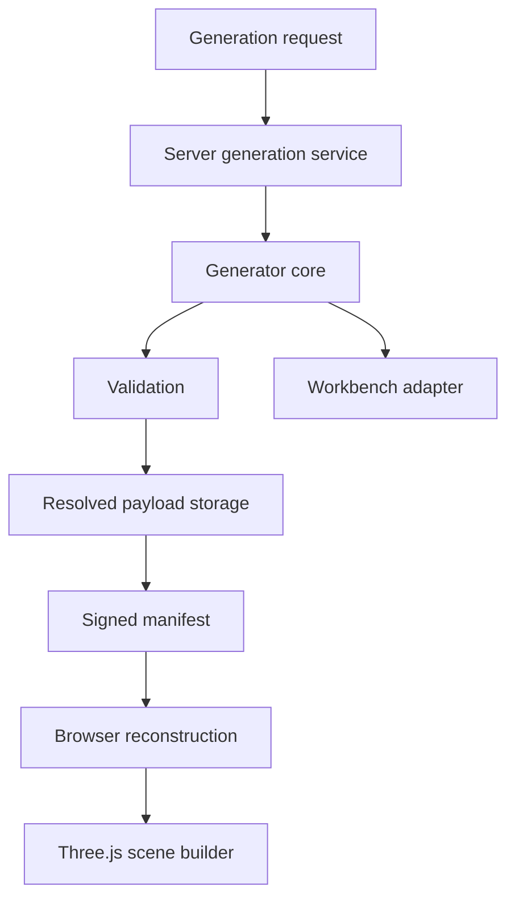
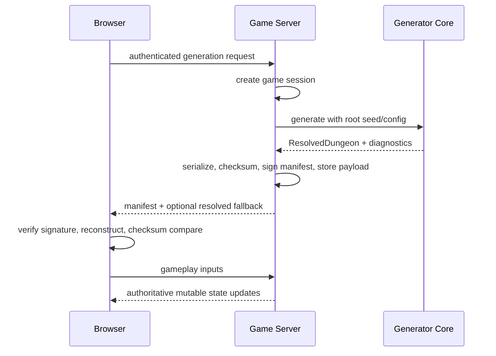
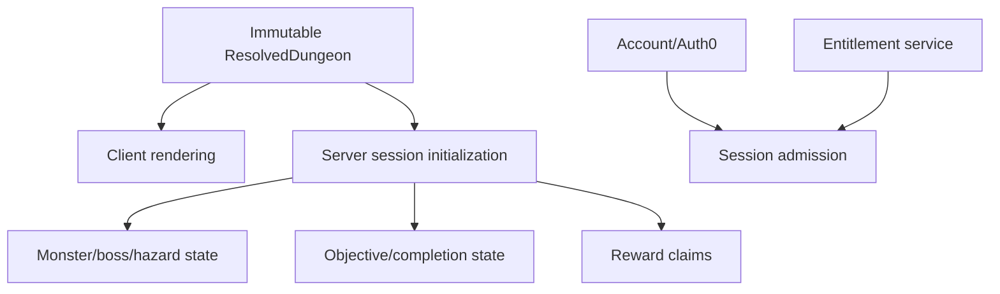
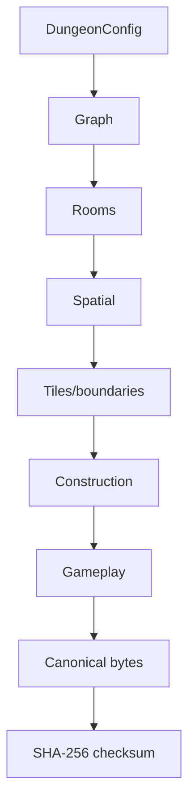

**DOC1 status:** Supporting/historical reference. For current implemented authority, lifecycle, runtime, and commands, defer to [README.md](README.md), [main_blueprint.md](main_blueprint.md), and [doc1_operations.md](doc1_operations.md).

# Architecture

[Package README](README.md) · [Main Blueprint](main_blueprint.md) · [Traceability](requirements_traceability.md) · [Glossary](glossary.md)

## Proposed components
| Component | Responsibility | Boundary |
|---|---|---|
| Server generation service | Accepts generation request, creates session, invokes generator, stores `ResolvedDungeon`, signs manifest | Server only |
| Generator core | Pure deterministic stages with named RNG streams | Shared server/client reconstruction |
| Environment registry | Versioned Catacombs profile and future planned profiles | Shared contract |
| Graph module | Layered braided grammar and validation | Shared |
| Room assignment module | Archetype selection and room constraints | Shared |
| Spatial embedding | Forward-axis/lane placement, separation, routing inputs | Shared |
| Corridor routing/rasterization | Physical connections, tile layers, boundaries | Shared |
| Navigation/clearance | Distance fields, clearance fields, traversal regions | Shared |
| Construction placement | Asset IDs, sockets, footprints, fallback equivalence | Shared data, renderer consumes |
| Asset registry | Authored/fallback registry and dependencies | Content registry |
| Gameplay placement | Immutable placements from content tables | Server generated/shared read |
| Validation | Contract, graph, spatial, content, performance issues | Shared |
| Canonical serialization/checksum | Stable bytes and SHA-256 | Shared |
| Manifest signing | Digital signature, key management boundary | Server only |
| Resolved-payload storage | Compatibility fallback and audit source | Server only |
| Browser reconstruction | Deterministic rebuild and checksum compare | Client, non-authoritative |
| Workbench adapter | Single-file diagnostic adapter to shared modules | Diagnostic |
| Three.js scene builder | Builds render objects from resolved data | Client presentation |
| Mutable session state | Objectives, monsters, boss, hazards, rewards | Online gameplay server |
| Observability | Metrics, audit events, failure diagnostics | Server/client split |

## Component architecture

## Server/client lifecycle

## Immutable versus mutable state

## Generation data flow

