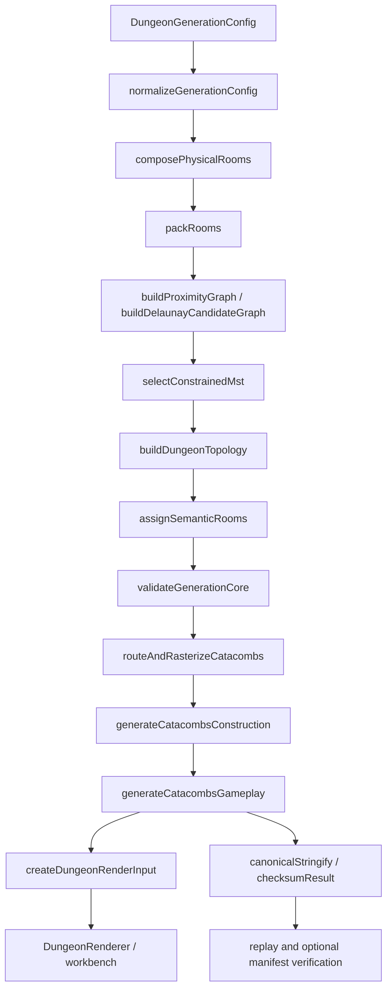

# Main Blueprint — Implemented Catacombs Generator

[Package README](README.md) · [Operations Guide](doc1_operations.md) · [Traceability](requirements_traceability.md) · [Glossary](glossary.md)

**Kind:** Normative. **Status:** reconciled with completed D1, D2, D3, T1A, T1B, and T1C implementation. This file is the authoritative architectural and implementation contract for the Catacombs generator; historical phase plans defer to this document when they describe completed work as planned.

## 1. Scope and non-goals

The Catacombs generator is a deterministic Web Companion App dungeon generator for the currently implemented **Catacombs** environment. Planned future environments are **Garden Maze**, **Dark Tower**, and **Hell’s Canyon**. The generator does not directly create Godot/MMORPG client maps and does not mutate inventory, currency, XP, loot, sessions, entitlements, combat, movement, character, zone, or world state.

DOC1 documents completed behavior only. It does not begin a new environment generator, gameplay feature, visual redesign, production refactor, checksum update, seed-suite change, or next prototype milestone.

## 2. Requirement/design/implementation status model

| Label | Meaning |
| --- | --- |
| Original requirement | Intent captured by earlier blueprint prompts. |
| Locked decision | Stable design decision that future work must preserve unless versioned and reviewed. |
| Implemented behavior | Behavior present in repository code. |
| Verified behavior | Behavior covered by T1 tests, replay, browser/security/performance/coverage gates, or CI. |
| Deferred behavior | Explicit future scope; not complete today. |
| Future extension point | Supported way to extend without breaking determinism or authority boundaries. |

## 3. Locked authority and product boundaries

- **Server authority:** canonical generation and signed online manifests are server-authoritative boundaries. The client may verify, reconstruct, compare checksums, and render, but may not grant authoritative outcomes.
- **Client render boundary:** `DungeonRenderInput` from `src/dungeon/renderInput.ts` is the renderable client contract. It excludes signed manifest authority and support diagnostics.
- **Diagnostic boundary:** `ResolvedDungeon` and `GenerationDiagnostics` are diagnostic/reference concepts, not production render input and not proof of rewards or sessions.
- **Workbench boundary:** local workbench generation is a development/prototype facility. Import/export bundles and replay records are inspection inputs only.
- **Online authorization:** signed manifests must validate key, algorithm, expiry, binding, compatibility, integrity, and checksum expectations. Test keys/prototype algorithms are rejected in production verification.

## 4. Implemented generation lifecycle

## 5. Stage reference

| Stage | Primary source | Inputs | Outputs | Deterministic inputs | Failure behavior | Invariants | Authority kind |
| --- | --- | --- | --- | --- | --- | --- | --- |
| Configuration normalization | `src/dungeon/generation/configuration.ts` | `DungeonGenerationConfig` | normalized generation config | numeric/string config fields, generator version | `CONFIG_INVALID`-style core failure | room counts, bounds, density and routing values are clamped/validated | canonical input |
| Physical room composition | `src/dungeon/generation/roomComposition.ts` | normalized config | `PhysicalRoomCandidate[]`, `CoreRoomCompositionProfile` | seed stream and config | composition failure with retry metadata | stable candidate ids, mandatory entrance/boss roles | canonical derived |
| Shape-aware packing | `src/dungeon/generation/packing.ts` | candidates and config | `PackedRoomLayout` | seeded ordering and dimensions | packing failure | no padding conflicts; bounds respected | canonical derived |
| Delaunay candidate graph | `src/dungeon/generation/delaunay.ts`, `proximityGraph.ts` | packed centers sorted by id | `SpatialCandidateGraph` | stable point ordering, max edge distance | `CANDIDATE_GRAPH_ILLEGAL` when connectivity/provenance fails | real Delaunay edges plus bounded fallback for degeneracy/connectivity | canonical derived |
| Constrained MST | `src/dungeon/generation/constrainedMst.ts` | candidate graph | MST edge list | canonical undirected edge ids and weights | MST failure when disconnected | exactly `roomCount - 1` MST edges | canonical derived |
| Topology refinement | `src/dungeon/generation/topology.ts` | candidates, graph, MST | `DungeonTopology` | stable edge ordering | core failure | critical path includes entrance and boss; braided rules remain declared | canonical derived |
| Semantic reconciliation | `src/dungeon/generation/semanticReconciliation.ts` | topology and candidates | `SemanticRoomLayout` | seed/config/profile | validation failure | mandatory Catacombs archetypes unique; no placeholders | canonical derived |
| Core validation | `src/dungeon/generation/validation.ts` | all core structures | `GeneratorCoreResult` or `GeneratorCoreFailure` | canonical structures | structured failure, no partial success | provenance/connectivity/semantic completeness | canonical/diagnostic result union |
| Doorways and routing | `src/dungeon/catacombsRouting.ts`, `src/dungeon/routing/` | assigned/embedded rooms and topology projection | routed corridors, doorways, tile layers, navigation | seed/config/routing width | `ROUTING_FAILED` with diagnostics | corridors reserve occupancy; declared graph equivalent to navigable geometry | canonical derived + diagnostics |
| Construction records | `src/dungeon/construction.ts` | routing, rooms, environment | records, sockets, batches, asset resolutions | root seed, generator version, registry | validation diagnostics, fallback assets where allowed | stable record ids and owner-valid sockets | renderable/canonical projection |
| Gameplay placement | `src/dungeon/gameplay.ts`, `gameplayTransformations.ts` | config, rooms, sockets, navigation | placement records and dependencies | game type, difficulty, player count, seed | `GAMEPLAY_FAILED` if validation invalid | owner-valid placements; no reward/session authority | renderable/canonical projection |
| Render input | `src/dungeon/renderInput.ts` | routing, construction, gameplay | `DungeonRenderInput` | derived production records | no authority payload emitted | diagnostics/manifests excluded | client render contract |
| Canonical checksum/replay | `src/dungeon/canonical/`, `test/dungeon/t1c/replay.ts` | canonical projection/result | SHA-256 checksum, replay result | supported runtime, schema, generator version, canonical config | checksum/version/seed mismatch errors | stable key ordering; lossless typed arrays where used | verification artifact |
| Online manifest boundary | `src/dungeon/authorization/online.ts`, `authorization/manifest.ts` | checksum, versions, signing context | signed manifest or verification result | manifest payload and verification context | structured protocol errors | no test keys in production; binding/expiry/integrity enforced | server-authorized boundary |
| Workbench visualization | `src/dungeon/workbench/`, `src/dungeon/rendering/` | render input and presentation controls | Three.js scene and inspector state | canonical controls only affect generation | safe user-visible failure state | presentation controls do not change canonical output | presentation-only |

## 6. Public contract reference

Use source as the authoritative contract. Do not duplicate large TypeScript interfaces in documentation.

| Contract/result | Source | Purpose | Producer | Consumer | Authority/stability | Network/persistence | Diagnostics |
| --- | --- | --- | --- | --- | --- | --- | --- |
| `DungeonGenerationConfig` | `src/dungeon/spatialEmbedding.ts`, re-exported by `src/dungeon/generation/types.ts` | Canonical generation input. | caller/workbench/server | generation core | versioned canonical input | may be persisted/replayed after validation | no |
| `CoreRoomCompositionProfile` | `src/dungeon/generation/roomComposition.ts` | Composition policy. | generator | core stages/tests | reference/profile | persisted only as profile/version evidence | no |
| `PhysicalRoomCandidate` | `src/dungeon/spatialEmbedding.ts` | Physical candidate room. | composition | packing/topology | canonical derived | replay/debug only | no |
| `PackedRoomLayout` | `src/dungeon/spatialEmbedding.ts` | Packed shape-aware layout. | packing | Delaunay graph/validation | canonical derived | replay/debug only | no |
| `SpatialCandidateGraph` | `src/dungeon/spatialEmbedding.ts`, `src/dungeon/generation/delaunay.ts` | Delaunay/fallback graph. | graph stage | MST/topology | canonical derived | replay/debug only | metrics may describe provenance |
| `DungeonTopology` | `src/dungeon/spatialEmbedding.ts` | Room graph topology. | topology | semantics/routing | canonical derived | replay/debug only | no |
| `SemanticRoomLayout` | `src/dungeon/spatialEmbedding.ts` | Archetype/semantic assignment. | semantic reconciliation | routing/construction/gameplay | canonical derived | replay/debug only | no |
| `GeneratorCoreResult` / `GeneratorCoreFailure` | `src/dungeon/spatialEmbedding.ts`, `src/dungeon/generation/index.ts` | Core success/failure union. | core generator | production pipeline/tests | structured result | failures may be persisted for support | failure metadata only |
| `GenerationObserver` | `src/dungeon/spatialEmbedding.ts` | Optional stage observation. | caller | generation stages | diagnostic hook | do not cross production client boundary | yes |
| `PostTopologyGenerationResult` | `src/dungeon/generationPipeline.ts` | Full Catacombs pipeline success/failure union. | `generateCatacombs` | tests/server/workbench adapters | production-facing result | success may feed render/manifest; failure support-safe | failure details may contain diagnostics |
| `DungeonRenderInput` | `src/dungeon/renderInput.ts` | Client render input. | pipeline | renderer/workbench | stable client contract | may cross client boundary after validation | no production diagnostics |
| Construction records | `src/dungeon/construction.ts` | Floors, walls, doorways, corridors, sockets, batches. | construction stage | renderer/gameplay placement | canonical projection + render metadata | may cross render boundary | diagnostics separate |
| Gameplay placements | `src/dungeon/gameplay.ts` | Presentation locations for starts, encounters, hazards, objectives, rewards, boss markers. | gameplay stage | renderer/workbench | canonical presentation; not reward authority | render boundary only | validation separate |
| Routing diagnostics/failures | `src/dungeon/routing/types.ts`, `src/dungeon/catacombsRouting.ts` | Explain safe routing failures. | routing | tests/support/workbench | diagnostic | persist support artifacts carefully | yes |
| Replay records | `test/dungeon/t1c/replay.ts` | Reproduce success/failure cases. | property/regression tooling | replay CLI | versioned test artifact | may be persisted in corpus/artifacts | failure records include support-safe fields |
| Shard results/reconciliation | `test/dungeon/property`, `scripts/t1/reconcile.ts` | Deterministic seed-suite artifacts. | property tests | CI/reconciler | generated evidence | artifacts under `artifacts/t1/property` | failure records include replay context |
| Online manifests/results | `src/dungeon/authorization/online.ts`, schemas | Signed authorization and client verification. | server/test service | client authorization | server-authorized; versioned | may cross network boundary | diagnostics summarized, no secrets |

## 7. Determinism and canonicalization

- T1 property/replay canonical seeds are unsigned 32-bit numbers; `normalizeT1Seed` rejects non-integers, negative values, values above `0xffffffff`, and aliases such as `seed-*`.
- Determinism is scoped to supported Node.js 24.18.0, generator/schema versions, canonical configuration, dependency behavior, and canonical serialization version. Cross-version checksum stability is not promised.
- Seeded randomness is owned by deterministic RNG streams derived from root seed, generator version, stream namespace, and attempt index.
- Stable ids and ordering are required for rooms, edges, construction records, gameplay placements, overlays, replay records, and shard artifacts.
- Delaunay points are sorted by id before triangulation; undirected edge ids are canonicalized; constrained MST ordering is deterministic.
- Canonical serialization uses stable key ordering and excludes volatile diagnostics/UI/presentation-only state from production checksums.
- Presentation controls such as quality, animation speed, wall fading, reduced motion, and post-processing must not change canonical generation output.
- Checksum-affecting changes require an intentional generator/schema/serialization version update, replay corpus update, coverage/performance requalification, and documentation update. Do not update canonical checksums for documentation-only changes.

## 8. Failure and diagnostic model

Public generation results use `ok: true` / `ok: false` discriminators. Failures include stage ownership, code, message, retryability where available, affected target ids where available, and support-safe details. No stage returns a partial authoritative success. Workbench code catches generation exceptions and converts them to a safe visible failure state. The authoritative failure-code source is the implementation and tests (`src/dungeon/generation/validation.ts`, `src/dungeon/generation/*`, `src/dungeon/routing/*`, `src/dungeon/authorization/*`, and `test/dungeon/**`); docs intentionally avoid duplicating an unstable registry.

## 9. Verification status

The completed T1 state includes D1 deterministic spatial foundation with real Delaunay proximity graph, D2 production Catacombs pipeline/routing, D3 Three.js renderer and single-file workbench, T1A/T1B/T1C verification, deterministic property sharding, replay corpus, performance qualification, resource stability checks, coverage reconciliation, and CI completion. Current evidence and commands are maintained in [doc1_operations.md](doc1_operations.md).

## 10. Deferred scope and extension points

Deferred work includes Garden Maze, Dark Tower, Hell’s Canyon, final authored Catacombs art/asset pack, broader service deployment, production combat/stat balancing, and live reward/session/entitlement services. Future environments should reuse graph/pipeline/render contracts and add environment-specific profiles or specialized stages only when required and versioned.
